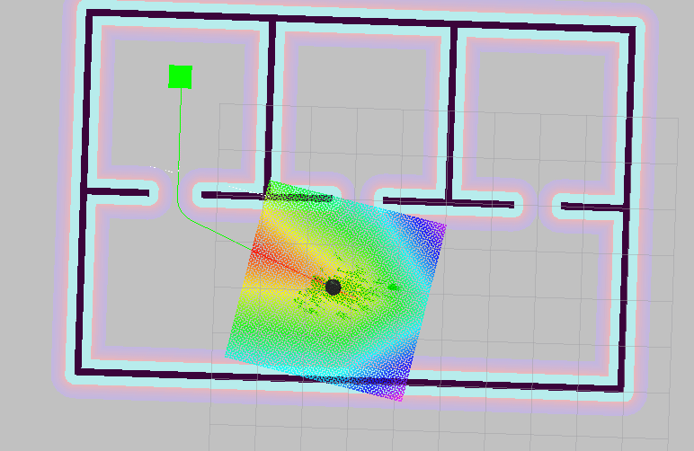
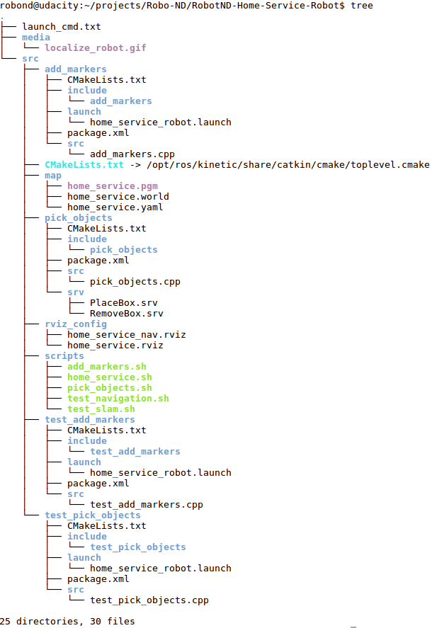

# Robotics : Home Service Robot!
A robot transports an item from a pick-up station to a delivery station. The robot perform [SLAM](http://wiki.ros.org/gmapping) and build a map of the environment and using the [ROS](https://www.ros.org/) navigation stack creates a path based on Dijkstra's algorithm, a variant of the Uniform Cost Search algorithm.


This project is part of my robotics nano degree of[ Udacity](https://www.udacity.com/course/robotics-software-engineer--nd209). 

### Example

+ ** robot transports an item**


<br>

## Important files
- /src/add_markers/* : add and delete a item
- /src/pick_objects/* : send location of the pick-up zone and drop-off zone
- /src/turtlebot_* /* : the robot
- src/slam_gmapping/* : the slam algorithm


### Project tree with important files and diretories
 

<br>
  
## Installation and usage
***The application runs on Ubuntu with ROS installed.***

Clone the repository
```sh
$ cd <your workspace folder>
$ git clone https://github.com/embmike/RobotND-Home-Service-Robot.git
```
 
Build packages
```sh
$ cd /<your workspace folder>/RobotND-Home-Service-Robot
$ catkin_make
```
 
Launch the robot inside the world and run the robot
```sh
$ cd /<your workspace folder>/RobotND-Home-Service-Robot/src/scripts
$ chmod +x cd home_service.sh
$ ./home_service.sh
```

Now the robot moves to the pick-up zone.

<br>

## Licence
This project is licensed under the terms of the [](https://opensource.org/licenses/MIT)
